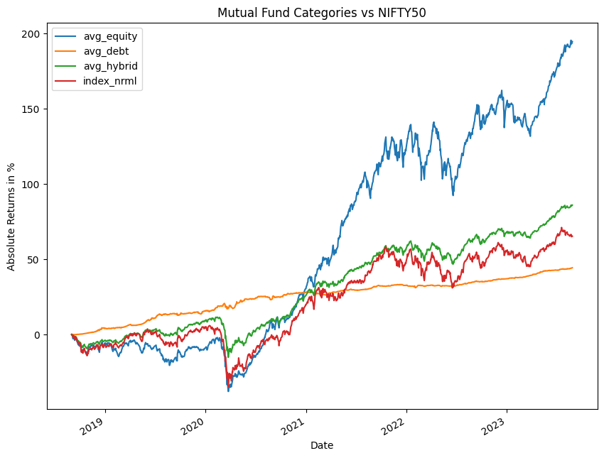

🟢 MUTUAL FUND ANALYTICS USING PANDAS 🟢\
\
Preface :

This analysis aims to compare the three major categories of mutual funds
:\
\
1.Equity :\
Equity funds primarily invest in stocks, and hence go by the name of
stock funds as well. They invest the money pooled in from various
investors from diverse backgrounds into shares/stocks of different
companies. The gains and losses associated with these funds depend
solely on how the invested shares perform (price-hikes or price-drops)
in the stock market. Also, equity funds have the potential to generate
significant returns over a period. Hence, the risk associated with these
funds also tends to be comparatively higher.

2.Debt :\
Debt funds invest primarily in fixed-income securities such as bonds, securities and treasury bills. They invest in various fixed income instruments such as Fixed Maturity Plans (FMPs), Gilt Funds, Liquid Funds, Short-Term Plans, Long-Term Bonds and Monthly Income Plans, among others. Since the investments come with a fixed interest rate and maturity date, it can be a great option for passive investors looking for regular income (interest and capital appreciation) with minimal risks. 

3.Hybrid :\
As the name suggests, hybrid funds (Balanced Funds) is an optimum mix of bonds and stocks, thereby bridging the gap between equity funds and debt funds. The ratio can either be variable or fixed. In short, it takes the best of two mutual funds by distributing, say, 60% of assets in stocks and the rest in bonds or vice versa. Hybrid funds are suitable for investors looking to take more risks for ‘debt plus returns’ benefit rather than sticking to lower but steady income schemes. 

Data Sources :

Mutual fund historical data was obtained using the mftool library(https://github.com/NayakwadiS/mftool),
Historical data for NIFTY50 index was obtained from yahoo finance and extracted in a csv format. The collected data is of the last 5 years.
Detailed steps of how the data was extracted can be found in the jupyter notebook. 

Project Walkthrough :

* I have selected 3 mutual funds from each of the above mentioned categories, these 3 were top rated in their categories as per moneycontrol.com, calculated the mean of all 3 in each category , this mean will represent the particular category in the analysis

* normalized the data to aid in better comparison ( refer the jupyter notebook)

* The result after merging the data was as represented in the following plot :

<noscript></noscript><object class='tableauViz'  style='display:none;'><param name='host_url' value='https%3A%2F%2Fpublic.tableau.com%2F' /> <param name='embed_code_version' value='3' /> <param name='site_root' value='' /><param name='name' value='Mutual_Fund_Analytics&#47;Dashboard1' /><param name='tabs' value='no' /><param name='toolbar' value='yes' /><param name='static_image' value='https:&#47;&#47;public.tableau.com&#47;static&#47;images&#47;Mu&#47;Mutual_Fund_Analytics&#47;Dashboard1&#47;1.png' /> <param name='animate_transition' value='yes' /><param name='display_static_image' value='yes' /><param name='display_spinner' value='yes' /><param name='display_overlay' value='yes' /><param name='display_count' value='yes' /><param name='language' value='en-US' /></object>
               